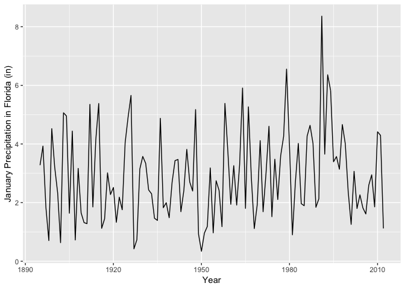

"**No one can know it all, we are expected to look shit up [google it] when programming.**"---Deirdre Toher

### Schedule (subject to change with notice)

Week | Day      | Date         | Topic
-----|----------|--------------|------
1    | Tuesday  | August 28    | Introduction
1    | Thursday | August 30    | RStudio and R 
2    | Tuesday  | September 4  | Working with R
2    | Thursday | September 6  | Data and Data Frames
3    | Tuesday  | September 11 | Data Munging
3    | Thursday | September 13 | Data Munging
4    | Tuesday  | September 18 | Making Graphs
4    | Thursday | September 20 | Making Graphs
5    | Tuesday  | September 25 | Maps in R
5    | Thursday | September 27 | Maps in R
6    | Tuesday  | October 2    | Review for First Exam
6    | Thursday | October 4    | FIRST EXAM
7    | Tuesday  | October 9    | Bayesian Data Analysis
7    | Tuesday  | October 11   | Bayesian Data Analysis
8    | Tuesday  | October 16   | Linear Regression
8    | Thursday | October 18   | Linear Regression
9    | Tuesday  | October 23   | Linear Regression
9    | Thursday | October 25   | Classification & Regression Trees
10   | Tuesday  | October 30   | Logistic Regression
10   | Thursday | November 1   | Quantile Regression
11   | Tuesday  | November 6   | Spatial Data
11   | Thursday | November 8   | Geographic Regression
12   | Tuesday  | November 13  | Geographic Regression
12   | Thursday | November 15  | Spatial Autocorrelation
13   | Tuesday  | November 20  | NO CLASS (out of town)
13   | Thursday | November 22  | NO CLASS (Thanksgiving)
14   | Tuesday  | November 27  | Spatial Autocorrelation
14   | Thursday | November 29  | Spatial Regression
15   | Tuesday  | December 4   | Spatial Regression
15   | Thursday | December 6   | Review for Second Exam
16   | Friday   | December 14  | SECOND EXAM (3-5p)

After today you will know how to work with data (small amounts) in R. Let's review a few things from last class.

1. You interact with R using the RStudio IDE. RStudio has four windows. The upper left window contains the markdown file. This is your electronic notebook. Each class lesson, problem set, etc is in a different Rmd file. The lower left window is the R console. This is your 'sandbox' for testing code.

2. The Rmd file contains text and code chunks. Code chunks start with three grave accents `(```)` followed by `{r}`. The code chunk ends with three additional grave accents. The `Knit` button in the upper left window changes (renders) the Rmd file to HTML. The rendering includes executing the code. An error will occur when you press the `Knit` button if the code refers to a function in a package that is not loaded in the workspace. 

3. The workspace refers to a directory on your computer. You can see your current workspace along the top of the Console panel. NOTE: The workspace used when you render is NOT the same as your current workspace.

## Concatenate

The `c()` function is used to get data (small amounts) into R. It combines (concatenates) the numbers into a single vector of data. Example: consider a set of annual land falling hurricane counts over a ten-year period.

2  3  0  3  1  0  0  1  2  1

To enter these into your environment, type

```r
counts <- c(2, 3, 0, 3, 1, 0, 0, 1, 2, 1)
counts
```

```
##  [1] 2 3 0 3 1 0 0 1 2 1
```

Notice a few things. We assign the values to an object called `counts`. The assignment operator is an equal sign (`=`). Values do not print. They are assigned to an object name. They are printed by typing the object name as we did on the second line. Finally, the values when printed are prefaced with a `[1]`. This indicates that the object is a vector and the first entry in the vector is a value of 2 (The number immediately to the right of [1]).

## Applying a function

Once the data are stored in an object we perform calculations on them.

```r
sum(counts)
```

```
## [1] 13
```

```r
length(counts)
```

```
## [1] 10
```

```r
sum(counts)/length(counts)
```

```
## [1] 1.3
```

Other helpful functions include, `sort()`, `min()`, `max()`, `range()`, `diff()`, and `cumsum()`.

## Mean

The average (or mean) value of a set of numbers ($x$'s) is defined as:
$$
\bar x = \frac{x_1 + x_2 + \cdots + x_n}{n}
$$
The function `mean()` makes this calculation on your set of counts.

```r
mean(counts)
```

```
## [1] 1.3
```

## Data vectors

The count data is stored as a vector. R keeps track of the order that the data were entered. First element, second element, and so on. This is good for a couple of reasons. Here the data have a natural order - year 1, year 2, etc. You don't want to mix these. You would like to be able to make changes to the data item by item instead of entering the entire data again. Also vectors are math objects making them easy to manipulate.

Suppose `counts` contain the annual number of land-falling hurricanes from the first decade of a longer record. You want to keep track of counts over other decades. This could be done by the following, example.

```r
cD1 <- counts
cD2 <- c(0, 5, 4, 2, 3, 0, 3, 3, 2, 1)
```
 
Note that you make a duplicate copy of the vector called `counts` giving it a different name.

Most functions operate on each element of the data vector at the same time.

```r
cD1 + cD2
```

```
##  [1] 2 8 4 5 4 0 3 4 4 2
```

The first year of the first decade is added from the first year of the second decade and so on.

What happens if you apply the `c()` function to these two vectors?

```r
c(cD1, cD2)
```

```
##  [1] 2 3 0 3 1 0 0 1 2 1 0 5 4 2 3 0 3 3 2 1
```

If you are interested in each year's count as a difference from the decade mean, you type:

```r
cD1 - mean(cD1)
```

```
##  [1]  0.7  1.7 -1.3  1.7 -0.3 -1.3 -1.3 -0.3  0.7 -0.3
```

In this case a single number (the mean of the first decade) is subtracted from each element of the vector of counts.

This is an example of data recycling. R repeats values from one vector so that the length of this vector matches the other, longer vector. Here the mean is repeated 10 times.

## Variance

Suppose you are interested in by how much the set of annual landfall counts varies from year to year. The formula for the variance is given by:
$$
\hbox{var}(x) = \frac{(x_1 - \bar x)^2 + (x_2 - \bar x)^2 + \cdots + (x_n - \bar x)^2}{n-1}
$$

Note: The formula is given as LaTeX math code with the double dollar signs starting (and ending) the math mode. It's a bit hard to read but it translates exactly to math as we would read it in a scientific article or textbook.

Although the `var()` function will compute this for you, here we see how it can be computed from other simpler functions. The first step is to find the squared difference between each value and the mean. To simplify things first create a new vector `x` and assign the mean of the `x`'s to `xbar`.

```r
x <- cD1
xbar <- mean(x)
x - xbar
```

```
##  [1]  0.7  1.7 -1.3  1.7 -0.3 -1.3 -1.3 -0.3  0.7 -0.3
```

```r
(x - xbar)^2
```

```
##  [1] 0.49 2.89 1.69 2.89 0.09 1.69 1.69 0.09 0.49 0.09
```

The sum of the differences is zero, but not the sum of the squared differences.

```r
sum((x - xbar)^2)
```

```
## [1] 12.1
```

```r
n <- length(x)
n
```

```
## [1] 10
```

```r
sum((x - xbar)^2)/(n - 1)
```

```
## [1] 1.344444
```

So the variance is 1.344. To verify with the `var()` function type

```r
var(x)
```

```
## [1] 1.344444
```

## Vector types

One restriction on data vectors is that all the elements must have the same type. This can be numeric as in counts or character strings as in

```r
simpsons <- c("Homer", "Marge", "Bart", "Lisa", "Maggie")
simpsons
```

```
## [1] "Homer"  "Marge"  "Bart"   "Lisa"   "Maggie"
```

Note that character strings are made with matching quotes, either double, ", or single, '.

If we mix element types within a data vector, all elements will be coerced into the 'lowest' common type, which is usually a character. Arithmetic does not work on character elements.

Returning to the land falling hurricane counts.

```r
cD1 <- c(2, 3, 0, 3, 1, 0, 0, 1, 2, 1)   
cD2 <- c(0, 5, 4, 2, 3, 0, 3, 3, 2, 1)
```

Now suppose the National Hurricane Center (NHC) reanalyzes a storm, and that the 6th year of the 2nd decade is a 1 rather than a 0 for the number of landfalls. In this case we type

```r
cD2[6] <- 1
```

The assignment to the 6th element in the vector cD2 is done by referencing the 6th element of the vector with square brackets `[]`. 

It's important to keep this in mind: Parentheses `()` are used for functions and square brackets `[]` are used to get values from vectors (and arrays, lists, etc). REPEAT: `[]` are used to extract or subset values from vectors, data frames, matrices, etc.

Print out all the elements of a data vector, print the 2nd element, the 4th element, all but the 4th element, all odd number elements.

```r
cD2
```

```
##  [1] 0 5 4 2 3 1 3 3 2 1
```

```r
cD2[2]  
```

```
## [1] 5
```

```r
cD2[4]
```

```
## [1] 2
```

```r
cD2[-4]
```

```
## [1] 0 5 4 3 1 3 3 2 1
```

```r
cD2[c(1, 3, 5, 7, 9)] 
```

```
## [1] 0 4 3 3 2
```

## Working smarter not harder

R's console keeps a history of our commands. The previous commands are accessed using the up and down arrow keys. Repeatedly pushing the up arrow will scroll backward through the history so we can reuse previous commands.

Many times we wish to change only a small part of a previous command, such as when a typo is made. With the arrow keys we can access the previous command then edit it as desired.

We can save the history into a file and then load it later.

```r
savehistory("Sep6")
loadhistory("Sep6")
```

There is often no need to save a history file. We can reproduce everything Run > Run All in the Rmd.

## Structured data

When data are in a pattern; for instance the integers 1 through 99. The colon `:` function is used for creating simple sequences.

```r
1:100
```

```
##   [1]   1   2   3   4   5   6   7   8   9  10  11  12  13  14  15  16  17
##  [18]  18  19  20  21  22  23  24  25  26  27  28  29  30  31  32  33  34
##  [35]  35  36  37  38  39  40  41  42  43  44  45  46  47  48  49  50  51
##  [52]  52  53  54  55  56  57  58  59  60  61  62  63  64  65  66  67  68
##  [69]  69  70  71  72  73  74  75  76  77  78  79  80  81  82  83  84  85
##  [86]  86  87  88  89  90  91  92  93  94  95  96  97  98  99 100
```

```r
rev(1:100)
```

```
##   [1] 100  99  98  97  96  95  94  93  92  91  90  89  88  87  86  85  84
##  [18]  83  82  81  80  79  78  77  76  75  74  73  72  71  70  69  68  67
##  [35]  66  65  64  63  62  61  60  59  58  57  56  55  54  53  52  51  50
##  [52]  49  48  47  46  45  44  43  42  41  40  39  38  37  36  35  34  33
##  [69]  32  31  30  29  28  27  26  25  24  23  22  21  20  19  18  17  16
##  [86]  15  14  13  12  11  10   9   8   7   6   5   4   3   2   1
```

```r
100:1
```

```
##   [1] 100  99  98  97  96  95  94  93  92  91  90  89  88  87  86  85  84
##  [18]  83  82  81  80  79  78  77  76  75  74  73  72  71  70  69  68  67
##  [35]  66  65  64  63  62  61  60  59  58  57  56  55  54  53  52  51  50
##  [52]  49  48  47  46  45  44  43  42  41  40  39  38  37  36  35  34  33
##  [69]  32  31  30  29  28  27  26  25  24  23  22  21  20  19  18  17  16
##  [86]  15  14  13  12  11  10   9   8   7   6   5   4   3   2   1
```

It's often necessary to specify either the step size and the starting and ending points or the starting and ending points and the length of the sequence. The `seq()` function does this.

```r
seq(1, 9, by = 2)
```

```
## [1] 1 3 5 7 9
```

```r
seq(1, 10, by = 2)
```

```
## [1] 1 3 5 7 9
```

```r
seq(1, 9, length = 5)
```

```
## [1] 1 3 5 7 9
```

To create a vector with each element having the same value use the `rep()` function. The simplest usage is to repeat the first argument a specified number of times.

```r
rep(1, 10)
```

```
##  [1] 1 1 1 1 1 1 1 1 1 1
```

```r
rep(1:3, 3)
```

```
## [1] 1 2 3 1 2 3 1 2 3
```

More complicated patterns can be repeated by specifying pairs of equal-sized vectors. In this case, each element of the first vector is repeated the corresponding number of times specified by the element in the second vector.

```r
rep(c("long", "short"), c(1, 2))
```

```
## [1] "long"  "short" "short"
```

## Asking questions

To find the most landfalls in the first decade, type:

```r
max(cD1)
```

```
## [1] 3
```

Which years had the most?

```r
cD1 == 3
```

```
##  [1] FALSE  TRUE FALSE  TRUE FALSE FALSE FALSE FALSE FALSE FALSE
```

Notice the double equals signs (`==`). This tests each value (element) in `cD1` to see if it is equal to 3. The 2nd and 4th values are equal to 3 so TRUEs are returned. Think of this as asking R a question. Is the value equal to 3?  R answers all at once with a vector of TRUE's and FALSE's.

How do we get the vector element corresponding to the TRUE values?  That is, which years have 3 landfalls?

```r
which(cD1 == 3)
```

```
## [1] 2 4
```

The function `which.max()` can be used to get the first maximum.

```r
which.max(cD1)
```

```
## [1] 2
```

We might also want to know the total number of landfalls in each decade and the number of years in a decade without a landfall. Or how about the ratio of the mean number of landfalls over the two decades.

```r
sum(cD1)
```

```
## [1] 13
```

```r
sum(cD2)
```

```
## [1] 24
```


```r
sum(cD1 == 0)
```

```
## [1] 3
```

```r
sum(cD2 == 0)
```

```
## [1] 1
```


```r
mean(cD2)/mean(cD1)
```

```
## [1] 1.846154
```

There are 85% more landfalls during the second decade. Is this increase statistically significant?

To remove an object from the environment we use the `rm()` function. Usually not needed unless we have very large objects (e.g., million cases).

```r
rm(cD1, cD2)
```

## Tables and summaries

All elements of a vector must be of the same type. For example, the vectors `A`, `B`, and `C` below are constructed as numeric, logical, and character, respectively.

First create the vectors then check the class.

```r
A <- c(1, 2.2, 3.6, -2.8) 
B <- c(TRUE, TRUE, FALSE, TRUE)
C <- c("Cat 1", "Cat 2", "Cat 3")
class(A)
```

```
## [1] "numeric"
```

```r
class(B)
```

```
## [1] "logical"
```

```r
class(C)
```

```
## [1] "character"
```

With logical and character vectors the `table()` function indicates how many occurrences for each element type. For instance, let the vector `wx` denote the weather conditions for five forecast periods as character data.

```r
wx <- c("sunny", "clear", "cloudy", "cloudy", "rain")
class(wx)
```

```
## [1] "character"
```

```r
table(wx)
```

```
## wx
##  clear cloudy   rain  sunny 
##      1      2      1      1
```

The output is a list of the character strings and the corresponding number of occurrences of each string.

As another example, let the vector `ss` denote the Saffir-Simpson category for a set of five hurricanes.

```r
ss <- c("Cat 3", "Cat 2", "Cat 1", "Cat 3", "Cat 3")
table(ss)
```

```
## ss
## Cat 1 Cat 2 Cat 3 
##     1     1     3
```

Here the character strings correspond to different intensity levels as ordered categories with Cat 1 < Cat 2 < Cat 3.  In this case convert the character vector to an ordered factor with levels. This is done with the function `factor()`.

```r
ss <- factor(ss, order = TRUE)
class(ss)
```

```
## [1] "ordered" "factor"
```

```r
ss
```

```
## [1] Cat 3 Cat 2 Cat 1 Cat 3 Cat 3
## Levels: Cat 1 < Cat 2 < Cat 3
```

The vector object is now an ordered factor. Printing the object results in a list of the elements in the vector and a list of the levels in order.  Note: if we do the same for the `wx` object, the order is alphabetical by default. Try it.

## Importing data

Two steps (1) where will R look for things and (2) what kind of data file do we want to import?

### Working directory

The working directory is where R looks to get and put things outside of the software. For example, this is where R looks for data. To determine your working directory type

```r
getwd()
```

```
## [1] "/Users/jameselsner/Desktop/ClassNotes/quant-geo"
```

A good strategy for this class is to download the Rmd lesson and problem set files into a folder on your desktop (call it `QG`). Then open the file. The working directory should then be something like `.../Desktop/QG/04-Lesson.Rmd`.

We can change the working directory from inside R (e.g., Under Session > Set Working Directory >) but it is not advisable. 

To list the files in our working directory (outside folder) we type 

```r
dir()
```

### What kind of data file do we want to import?

We also need to know what kind of data file we have. This determines the import function.  

For example, the data set *US.txt* on Canvas contains a list of tropical cyclone counts by year making land fall in the United States (excluding Hawaii) at hurricane intensity. The file is a space-delimited text file so you use the `read.table()` function to import data. 

If our data file has column names (header record) then use the `header = TRUE` argument.

Make sure the text file *US.txt* is in your working directory and type

```r
H <- read.table(file = "US.txt", 
                header = TRUE)
```

If you get a prompt without an error message, the data has been imported. If you get an error it is likely that the data file is not in your working directory. This will give an error message along the lines of 'cannot open the connection' or 'cannot open file.' If this happens, move the file to your working directory or change your working directory, then try again.

If your file has comma's between columns then use the argument `sep = ","` in the function. No changes are made to your original data file.

`NA` is used for missing values and `NaN` for not a number. If the missing value character in your file is coded as `99`, specify `na.strings = "99"`.

Several variants of `read.table()` differ only in the default argument settings. `read.csv()` has settings that are suitable for comma delimited (csv) files that have been exported from a spreadsheet.  

A typical work flow might be to export data from a spreadsheet using the csv file format then import it to R using the `read.csv()` function.

We can import data directly from the web by specifying the URL instead of the local file name. Of course this requires that we are connected to the internet.

```r
loc <- "http://myweb.fsu.edu/jelsner/temp/data/US.txt"
H <- read.table(file = loc, header = TRUE)
```

The distribution of Florida hurricanes by year is obtained by typing

```r
table(H$FL)
```

```
## 
##  0  1  2  3  4 
## 93 43 24  5  1
```

We reference the columns using the `$` syntax. For example, type

```r
H$FL
```

```
##   [1] 1 2 0 0 0 1 0 0 0 0 0 0 0 0 1 0 0 0 0 1 2 0 2 1 0 1 2 1 0 3 0 2 0 0 0
##  [36] 3 1 2 0 0 0 0 1 2 0 3 1 1 1 0 1 0 1 0 0 2 0 0 1 1 1 0 0 0 1 2 1 0 1 0
##  [71] 1 0 0 2 1 2 0 2 1 0 0 0 2 2 2 1 0 0 1 0 1 2 0 1 2 1 2 2 1 2 0 0 1 0 0
## [106] 1 0 0 0 1 0 0 0 3 1 2 1 1 0 0 0 1 0 0 1 0 0 0 1 0 0 0 0 0 2 0 1 0 1 0
## [141] 0 1 0 0 2 0 0 2 1 0 0 0 0 4 3 0 0 0 0 0 0 0 0 0 0 1
```

```r
sum(H$FL)
```

```
## [1] 110
```

```r
table(H$FL)
```

```
## 
##  0  1  2  3  4 
## 93 43 24  5  1
```

There are 93 years without a FL hurricane, 43 years with exactly one, and so on.

## Data frames

The function `read.table()` (and its variants) return data frames. `H` is a data frame.  

A data frame is like a spreadsheet. Values are arranged in rows and columns. Rows are the cases (observations) and columns are the variables. The `dim()` function gives the size of the data frame (number of rows and number of columns).

```r
dim(H)
```

```
## [1] 166   6
```

There are 166 rows and 6 columns in the data frame.

Note: Here we use inline code. Open with a single grave accent followed by the letter r and close with a grave accent.

To list the first six lines of the data object, type

```r
head(H)
```

```
##   Year All MUS G FL E
## 1 1851   1   1 0  1 0
## 2 1852   3   1 1  2 0
## 3 1853   0   0 0  0 0
## 4 1854   2   1 1  0 1
## 5 1855   1   1 1  0 0
## 6 1856   2   1 1  1 0
```

The columns include year, number of hurricanes, number of major hurricanes, number of Gulf coast hurricanes, number of Florida hurricanes, and number of East coast hurricanes in order. Column names are printed as well.  

The last six lines of the data frame are listed similarly using the `tail()` function. The number of lines listed is changed using the argument `n =`.

```r
tail(H, n = 3)
```

```
##     Year All MUS G FL E
## 164 2014   1   0 0  0 1
## 165 2015   0   0 0  0 0
## 166 2016   2   0 0  1 1
```

The number of years in the record is assigned to the object `nY` and the annual average number of hurricanes (rate) is assigned to the object `rate`.

```r
nY <- length(H$All)
rate <- mean(H$All)
```

By typing the names of the saved objects, the values are printed.

```r
nY
```

```
## [1] 166
```

```r
rate
```

```
## [1] 1.668675
```

Thus over the 166 years of data the average number of hurricanes per year is 1.67.

If we want to change the names of the columns in the data frame, type

```r
names(H)[4] <- "GC"
names(H)
```

```
## [1] "Year" "All"  "MUS"  "GC"   "FL"   "E"
```

This changes the 4th column name from G to GC. Note that this change occurs to the data frame in R and not to your original data file.

Most of our work with R will involve data frames. A data frame is a tabular (rectangular) data structure, which means it has rows and columns.  It is like a matrix with column names. Actually it is a list:

* Elements of the list are vectors.
* Vectors are the columns in the data frame.
* Vectors must all have the same length; in other words, all columns must have the same height.
* Equal-height columns gives it a rectangular shape.
* Columns must have names.

To print the first column of values (the years) you can type:

```r
H[1]
```

Or

```r
H[, 1]
H[[1]]
H$Year
```

Data frames have two indices indicating the rows and columns in that order.

```r
H[10, 4]
```

```
## [1] 3
```

* To a statistician a data frame is a table of observations. Each row contains one observation. Each observation must contain the same variables. These variables are called columns, and you can refer to them by name.  You can also refer to the contents by row number and column number, just as with a matrix.

* To an Excel user a data frame is like a worksheet (or a range within a worksheet). A data frame is more restrictive, however, in that each column has a type.

* To an R programmer a data frame is a data structure, part matrix and part list.  A column can contain numbers, character strings, or factors but not a mix of them.  You can index the data frame just like you index a matrix. The data frame is also a list, where the list elements are the columns, so you can access columns by using list operators.

## Example: Florida precipitation by month

Source: Monthly climate series. http://www.esrl.noaa.gov/psd/data/timeseries/

Get monthly precipitation values for the state back to the year 1895. Copy/paste into a text editor (notepad) then import into R using the `read.table()` function. Add column names.

Here I did it for Florida and posted the file on my website. Missing values are coded as -9.900.

```r
loc <- "http://myweb.fsu.edu/jelsner/temp/data/FLprecip.txt"
FLp <- read.table(loc, na.string = "-9.900", 
                  header = TRUE)
```

Plot a time series graph.

```r
library(ggplot2)
ggplot(FLp, aes(x = Year, y = Jan)) +
  geom_line() +
  ylab("January Precipitation in Florida (in)")
```

<!-- -->

## Central tendency

The sample mean is a measure of the central tendency of a set of values. Typically there are more values near the mean. Similar with the median but it is more resistant to outliers. 

The median is the "middle" value of the distribution of numbers that are arranged from smallest to largest. With an odd number of data values, the median is the middle one; with an even number of data values, the median is the average of the two middle values.

What does "resistant" refer to? Consider the wealth (in 1000s of $) of five bar patrons.

```r
bar <- c(50, 60, 100, 75, 200)
```

Now consider the same bar and patrons after Jeff Bezos walks in.

```r
bar.with.gates <- c(bar, 50000)
```


```r
mean(bar)
```

```
## [1] 97
```

```r
mean(bar.with.gates)
```

```
## [1] 8414.167
```

```r
median(bar)
```

```
## [1] 75
```

```r
median(bar.with.gates)
```

```
## [1] 87.5
```

The difference in the mean wealth with and without Jeff Bezos present is substantial while the difference in medians is small. Statistics that are not greatly influenced be a few values far from the bulk of the data are called resistant statistics.

The median value divides the data set into the top 50% of the data values and the bottom 50% of the data values.

Another example, the `cfb` (**UsingR**) data set contains a sampling of the data contained in the Survey of Consumer Finances conducted in the year 2001 by the U.S. Federal Reserve Board. Some of the income values are much bigger than the bulk of the data. This tendency is common in income distributions (and it's getting worse), as a few people tend to accumulate enormous wealth.


```r
library("UsingR")
```

```
## Loading required package: MASS
```

```
## Loading required package: HistData
```

```
## Loading required package: Hmisc
```

```
## Loading required package: lattice
```

```
## Loading required package: survival
```

```
## Loading required package: Formula
```

```
## 
## Attaching package: 'Hmisc'
```

```
## The following objects are masked from 'package:base':
## 
##     format.pval, units
```

```
## 
## Attaching package: 'UsingR'
```

```
## The following object is masked from 'package:survival':
## 
##     cancer
```

```r
income <- cfb$INCOME
mean(income)
```

```
## [1] 63402.66
```

```r
median(income)
```

```
## [1] 38032.7
```

The data is skewed to the right. The mean value is larger than the median value. Skewed right indicates that there are more large values than small values. The "tail" of the distribution is longer on the right side.

Note: Some packages have built-in datasets. To see what datasets are available in a downloaded package, type

```r
data(package = "UsingR")
```

## Spread

A simple measure of the spread of data values is the range. The range is given by the minimum and maximum value or by the difference between them.

```r
range(income)
```

```
## [1]       0 1541866
```

```r
diff(range(income))
```

```
## [1] 1541866
```

Or using the central tendency as the center of a set of values, we can define spread in terms of deviations from the center. As we've seen the sum of the squared deviations from the center divided by sample length minus one is the sample variance.

```r
var(income)
```

```
## [1] 13070833215
```

```r
sqrt(var(income))
```

```
## [1] 114327.7
```

```r
sd(income)
```

```
## [1] 114327.7
```

To illustrate consider two sets of test scores.

```r
ts1 <- c(80, 85, 75, 77, 87, 82, 88)
ts2 <- c(100, 90, 50, 57, 82, 100, 86)
```

Some test score statistics are

```r
mean(ts1)
```

```
## [1] 82
```

```r
mean(ts2)
```

```
## [1] 80.71429
```

```r
var(ts1)
```

```
## [1] 24.66667
```

```r
var(ts2)
```

```
## [1] 394.2381
```

## Quantiles

Quantiles cut a set of ordered data into equal-sized data bins. The ordering comes from rearranging the data from lowest to highest. The first, or lower, quartile corresponding to the .25 quantile (25th percentile), indicates that 25% of the data have values less than this quantile value. The third quartile corresponding to the .75 quantile (75th percentile), indicates that 75% of the data have values less than this quantile value.

The `quantile()` function calculates sample quantiles on a vector of data. For example, consider again Florida precipitation for the month of June. First apply the `sort()` function on the June values (column indicated by the label Jun).

```r
loc <- "http://myweb.fsu.edu/jelsner/temp/data/FLprecip.txt"
FLp <- read.table(loc, 
                  na.string = "-9.900", 
                  header = TRUE)
sort(FLp$Jun)
```

```
##   [1]  2.303  2.445  3.292  3.643  3.673  3.898  3.908  4.089  4.202  4.401
##  [11]  4.500  4.598  4.739  4.747  4.820  4.838  4.965  5.098  5.099  5.160
##  [21]  5.182  5.221  5.321  5.349  5.362  5.422  5.440  5.531  5.588  5.602
##  [31]  5.607  5.614  5.696  5.718  5.724  5.752  5.803  5.866  5.887  5.896
##  [41]  5.931  5.971  5.998  6.142  6.147  6.171  6.220  6.258  6.269  6.281
##  [51]  6.351  6.392  6.392  6.470  6.540  6.541  6.591  6.739  6.789  6.900
##  [61]  6.991  6.998  7.002  7.009  7.012  7.049  7.057  7.098  7.118  7.208
##  [71]  7.306  7.348  7.450  7.451  7.481  7.666  7.707  7.748  7.876  8.000
##  [81]  8.040  8.158  8.168  8.243  8.317  8.378  8.389  8.432  8.488  8.578
##  [91]  8.663  8.874  8.880  8.940  8.969  8.976  9.106  9.308  9.349  9.481
## [101]  9.734  9.865  9.939  9.993 10.032 10.276 10.280 10.288 10.309 10.360
## [111] 10.529 10.858 11.014 11.228 11.824 12.034 12.379 13.156
```

Note the use of the dollar sign to indicate the column in the data frame.

Next find the 25th and 50th percentile values.

```r
quantile(FLp$Jun, probs = c(.25, .5))
```

```
##     25%     50% 
## 5.60325 6.84450
```

Of the 118 monthly precipitation values, 25% of them are less than 5.6 inches, 50% are less than 6.84 inches.  Thus there are an equal number of years with June precipitation between 5.6 and 6.84 inches.

The third quartile value corresponding to the .75 quantile (75th percentile) indicates that 75% of the data have a value less than this. The difference between the first and third quartile values is called the interquartile range (IQR). Fifty percent of all values lie within the IQR. The IQR is obtained using the `IQR()` function.

Another example: Consider the set of North Atlantic Oscillation (NAO) index values for the month of June from the period 1851--2010.  The NAO is a variation in the climate over the North Atlantic Ocean featuring fluctuations in the difference of atmospheric pressure at sea level between the Iceland and the Azores. The index is computed as the difference in standardized sea-level pressures. The standardization is done by subtracting the mean and dividing by the standard deviation. The units on the index is standard deviation.

First read the data consisting of monthly NAO values, then list the column names and the first few data lines.

```r
loc <- "http://myweb.fsu.edu/jelsner/temp/data/NAO.txt"
NAO <- read.table(loc, header = TRUE)
head(NAO)
```

```
##   Year   Jan   Feb   Mar   Apr   May   Jun   Jul   Aug   Sep   Oct   Nov
## 1 1851  3.29  1.03  1.50 -1.66 -1.53 -1.62 -5.39  4.68  1.85  0.78 -1.77
## 2 1852  1.46  0.41 -2.50 -1.60  0.25  0.09 -1.13  2.94 -2.02 -1.65 -0.93
## 3 1853  1.31 -4.04 -0.32  0.76 -3.17  1.09  1.76 -2.36 -0.22 -0.47  0.51
## 4 1854  1.28  1.72  2.67  0.88  0.04 -0.06 -1.92 -0.03  2.62  1.11 -1.56
## 5 1855 -1.84 -3.80 -0.05  0.99 -2.28  0.78 -2.61  3.81  0.79 -1.09 -2.42
## 6 1856 -1.25 -0.10 -2.27  2.00 -0.70  2.03 -0.16 -0.44 -0.50  1.12 -1.69
##     Dec
## 1  1.74
## 2  1.03
## 3 -4.28
## 4  2.42
## 5 -1.66
## 6 -0.23
```

Determine the 5th and 95th percentile values for the month of June.

```r
quantile(NAO$Jun, prob = c(.05, .95))
```

```
##     5%    95% 
## -2.808  1.891
```

## The summary method

The `summary()` function provides summary statistics for each column in your data frame. The statistics include output the mean, median, minimum, maximum, along with the first quartile and third quartile values.

```r
summary(FLp)
```

```
##       Year           Jan             Feb             Mar       
##  Min.   :1895   Min.   :0.340   Min.   :0.288   Min.   :0.496  
##  1st Qu.:1924   1st Qu.:1.766   1st Qu.:2.010   1st Qu.:2.142  
##  Median :1954   Median :2.695   Median :3.070   Median :3.324  
##  Mean   :1954   Mean   :2.901   Mean   :3.159   Mean   :3.652  
##  3rd Qu.:1983   3rd Qu.:3.990   3rd Qu.:4.150   3rd Qu.:5.083  
##  Max.   :2012   Max.   :8.361   Max.   :8.577   Max.   :8.701  
##                                                                
##       Apr             May             Jun              Jul        
##  Min.   :0.408   Min.   :0.900   Min.   : 2.303   Min.   : 4.050  
##  1st Qu.:1.674   1st Qu.:2.485   1st Qu.: 5.603   1st Qu.: 6.421  
##  Median :2.675   Median :3.796   Median : 6.845   Median : 7.517  
##  Mean   :2.922   Mean   :3.857   Mean   : 7.097   Mean   : 7.493  
##  3rd Qu.:4.144   3rd Qu.:4.792   3rd Qu.: 8.474   3rd Qu.: 8.347  
##  Max.   :7.457   Max.   :9.848   Max.   :13.156   Max.   :11.263  
##                                                                   
##       Aug              Sep              Oct             Nov       
##  Min.   : 4.053   Min.   : 2.126   Min.   :0.471   Min.   :0.370  
##  1st Qu.: 6.164   1st Qu.: 4.930   1st Qu.:2.479   1st Qu.:1.370  
##  Median : 7.102   Median : 6.680   Median :3.541   Median :2.139  
##  Mean   : 7.345   Mean   : 6.704   Mean   :3.803   Mean   :2.308  
##  3rd Qu.: 8.310   3rd Qu.: 7.955   3rd Qu.:4.899   3rd Qu.:3.110  
##  Max.   :13.090   Max.   :12.978   Max.   :9.556   Max.   :6.236  
##  NA's   :1        NA's   :1        NA's   :1       NA's   :1      
##       Dec       
##  Min.   :0.610  
##  1st Qu.:1.549  
##  Median :2.558  
##  Mean   :2.718  
##  3rd Qu.:3.521  
##  Max.   :7.668  
##  NA's   :1
```

Columns with missing values get a row output from the `summary()` function indicating the number of them (NA's).

## Creating a data frame

Most work is done on data frames. The `data.frame()` function creates a data frame from a set of vectors.

Consider ice volume (10$^3$ km$^3$) measurements from the arctic from 2002 to 2012. The measurements are taken on January 1st each year and are available from http://psc.apl.washington.edu/wordpress/research/projects/arctic-sea-ice-volume-anomaly/data/


```r
Volume <- c(20.233, 19.659, 18.597, 18.948, 17.820, 
           16.736, 16.648, 17.068, 15.916, 14.455, 
           14.569)
```

Since the data have a sequential order you create a data frame with year in the first column and volume in the second.

```r
Year <- 2002:2012
Ice.df <- data.frame(Year, Volume)
head(Ice.df)
```

```
##   Year Volume
## 1 2002 20.233
## 2 2003 19.659
## 3 2004 18.597
## 4 2005 18.948
## 5 2006 17.820
## 6 2007 16.736
```

What year had the minimum ice volume?

```r
which.min(Ice.df$Volume)
```

```
## [1] 10
```

```r
Ice.df[10, ]
```

```
##    Year Volume
## 10 2011 14.455
```

```r
Ice.df$Year[which.min(Ice.df$Volume)]
```

```
## [1] 2011
```

To coerce an object to a data frame use the function `as.data.frame()`. For example, let counts be a vector of integers.

```r
counts <- rpois(100, lambda = 1.66)
head(counts)
```

```
## [1] 1 2 2 1 1 4
```

```r
H <- as.data.frame(counts)
head(H)
```

```
##   counts
## 1      1
## 2      2
## 3      2
## 4      1
## 5      1
## 6      4
```

The column name in the data frame is the name of the vector.

Similarly for the ice volume data you can use the function `cbind()` within the function `as.data.frame()`.

```r
as.data.frame(cbind(Year, Volume))
```

```
##    Year Volume
## 1  2002 20.233
## 2  2003 19.659
## 3  2004 18.597
## 4  2005 18.948
## 5  2006 17.820
## 6  2007 16.736
## 7  2008 16.648
## 8  2009 17.068
## 9  2010 15.916
## 10 2011 14.455
## 11 2012 14.569
```
