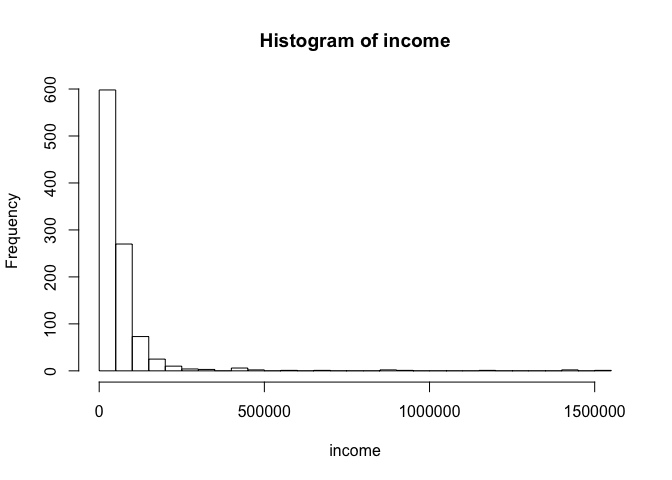
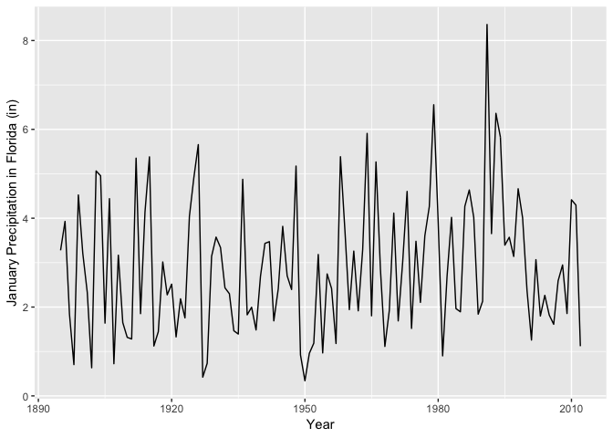

"**Science is the belief in the ignorance of experts.**"---Richard Feynman

After today you will be able to manipulate data frames. 

## Median

Recall that the mean is a statistic from our data. Typically there are more data values near the mean than far from it. The mean is often near the middle value in a set of observations.

The median is a statistic defined exactly as the middle value.

For example, consider a set of seven data values. Here the seven values are generated randomly but reproducibly. The `set.seed()` function guarantees that everyone (with a particular seed number) will get the same set of values.

```r
set.seed(3043)
y <- rnorm(7)
sort(y)
```

```
## [1] -1.855028975 -1.536523195 -1.113848013 -0.863720993 -0.813241685
## [6]  0.002064746  1.024752099
```

The argument value `7` guarantees seven values. They are sorted from lowest on the left to highest on the right with the `sort()` function. The middle value is the fourth value from the left in the ordered list of data values.

```r
median(y)
```

```
## [1] -0.863721
```

The median divides the data set into the top half (50%) of the data values and the bottom half of the data values.

With an odd number of values, the median is the middle one; with an even number of values, the median is the average of the two middle values.

```r
y <- rnorm(8)
sort(y)
```

```
## [1] -2.03716871 -1.32753574 -0.74852359 -0.62357212  0.07656504  0.50029011
## [7]  1.38629034  1.42971671
```

```r
median(y)
```

```
## [1] -0.2735035
```

We check to see this is true no matter what the values are

```r
y <- rnorm(8)
y_sorted <- sort(y)
median(y) == mean(c(y_sorted[4], y_sorted[5]))
```

```
## [1] TRUE
```

The median value, as a statistic representing the middle of a set of data values, is said to be resistant to outliers.

Consider the wealth (in 1000s of $) of five bar patrons.

```r
patrons <- c(50, 60, 100, 75, 200)
```

Now consider the same bar and patrons after a multimillionaire walks in.

```r
patrons_with_mm <- c(patrons, 50000)
```


```r
mean(patrons)
```

```
## [1] 97
```

```r
mean(patrons_with_mm)
```

```
## [1] 8414.167
```

```r
median(patrons)
```

```
## [1] 75
```

```r
median(patrons_with_mm)
```

```
## [1] 87.5
```

The difference in the mean wealth with and without the millionaire present is substantial while the difference in median wealth with and without the millionaire is small. 

Statistics that are not greatly influenced be a few values far from the bulk of the data are called resistant.

The `cfb` (available from the **UsingR** package) data set contains data from the Survey of Consumer Finances conducted by the U.S. Federal Reserve Board (in 2001). Some of the income values are much higher than the bulk of the data. This tendency is common in income distributions. A few people tend to accumulate enormous wealth (and it's getting worse).

Make the functions (and data) from the package available then assign to `income` the column `INCOME` in the `cfb` data frame. Then compute the mean and median.

```r
library("UsingR")
```

```
## Loading required package: MASS
```

```
## Loading required package: HistData
```

```
## Loading required package: Hmisc
```

```
## Loading required package: lattice
```

```
## Loading required package: survival
```

```
## Loading required package: Formula
```

```
## Loading required package: ggplot2
```

```
## 
## Attaching package: 'Hmisc'
```

```
## The following objects are masked from 'package:base':
## 
##     format.pval, units
```

```
## 
## Attaching package: 'UsingR'
```

```
## The following object is masked from 'package:survival':
## 
##     cancer
```

```r
income <- cfb$INCOME
mean(income)
```

```
## [1] 63402.66
```

```r
median(income)
```

```
## [1] 38032.7
```

Mean income is greater than median income. This indicates there are more very large income values than very small income values. 

This can be seen on a histogram. A histogram is a plot that displays the frequency of the values using intervals that divide the values into equal bins. This is done with the `hist()` function. Here we specify the number of intervals with the `breaks = ` argument.

```r
hist(income, 
     breaks = 25)
```

<!-- -->

The distribution is said to be right skewed. It has a long right tail.

Note: Packages often have built-in datasets. To see what datasets are available in a package, type

```r
data(package = "UsingR")
```

## Spread

One measure of the spread of data values is the range. The range is given by the minimum and maximum value (or by the difference between the minimum and maximum). Here we use the `range()` function.

```r
range(income)
```

```
## [1]       0 1541866
```

```r
diff(range(income))
```

```
## [1] 1541866
```

We also define spread in terms of deviations from the center value. As we've seen the sum of the squared deviations from the center divided by one minus the number of values is defined as the variance.

```r
var(income)
```

```
## [1] 13070833215
```

```r
sqrt(var(income))
```

```
## [1] 114327.7
```

```r
sd(income)
```

```
## [1] 114327.7
```

The mean and the variance describe different things about the distribution of data values. A set of values can have the same mean but different variance. To illustrate consider two sets of test scores.

```r
ts1 <- c(80, 85, 75, 77, 87, 82, 88)
ts2 <- c(100, 90, 50, 57, 82, 100, 86)
```

Some test score statistics are

```r
mean(ts1)
```

```
## [1] 82
```

```r
mean(ts2)
```

```
## [1] 80.71429
```

```r
var(ts1)
```

```
## [1] 24.66667
```

```r
var(ts2)
```

```
## [1] 394.2381
```

Nearly the same mean but large difference in variances.

## Quantiles

Quantiles cut a set of ordered data values into equal-sized bins. The ordering comes from rearranging the data from lowest to highest. The first, or lower, quartile corresponding to the .25 quantile (25th percentile), indicates that 25% of the values are less than this quantile number. The third quartile corresponding to the .75 quantile (75th percentile), indicates that 75% of the values are less than this quantile number.

The `quantile()` function returns sample quantiles from a vector of data. For example, consider Florida precipitation for the month of June. Source: Monthly climate series. http://www.esrl.noaa.gov/psd/data/timeseries/

First get the data into R. Copy/paste into a text editor (notepad) then import into R using the `read.table()` function. Add column names.

Here I did it for Florida and posted the file on my website. Missing values are coded as -9.900.

```r
loc <- "http://myweb.fsu.edu/jelsner/temp/data/FLprecip.txt"
FLp <- read.table(loc, 
                  na.string = "-9.900", 
                  header = TRUE)
```

Apply the `sort()` function on the June values (column indicated by the label Jun).

```r
sort(FLp$Jun)
```

```
##   [1]  2.303  2.445  3.292  3.643  3.673  3.898  3.908  4.089  4.202  4.401
##  [11]  4.500  4.598  4.739  4.747  4.820  4.838  4.965  5.098  5.099  5.160
##  [21]  5.182  5.221  5.321  5.349  5.362  5.422  5.440  5.531  5.588  5.602
##  [31]  5.607  5.614  5.696  5.718  5.724  5.752  5.803  5.866  5.887  5.896
##  [41]  5.931  5.971  5.998  6.142  6.147  6.171  6.220  6.258  6.269  6.281
##  [51]  6.351  6.392  6.392  6.470  6.540  6.541  6.591  6.739  6.789  6.900
##  [61]  6.991  6.998  7.002  7.009  7.012  7.049  7.057  7.098  7.118  7.208
##  [71]  7.306  7.348  7.450  7.451  7.481  7.666  7.707  7.748  7.876  8.000
##  [81]  8.040  8.158  8.168  8.243  8.317  8.378  8.389  8.432  8.488  8.578
##  [91]  8.663  8.874  8.880  8.940  8.969  8.976  9.106  9.308  9.349  9.481
## [101]  9.734  9.865  9.939  9.993 10.032 10.276 10.280 10.288 10.309 10.360
## [111] 10.529 10.858 11.014 11.228 11.824 12.034 12.379 13.156
```

Recall: the dollar sign is used after the data frame name to indicate that what follows is the name of the column of interest.

Next find the 25th and 50th percentile values.

```r
quantile(FLp$Jun, 
         probs = c(.25, .5))
```

```
##     25%     50% 
## 5.60325 6.84450
```

Of the 118 118 monthly precipitation values, 25% of them are less than 5.6 inches, 50% are less than 6.84 inches. 

Thus there are an equal number of years with June precipitation between 5.6 and 6.84 inches.

The third quartile value corresponding to the .75 quantile (75th percentile) indicates that 75% of the data have a value less than this. The difference between the first and third quartile values is called the interquartile range (IQR). Fifty percent of all values lie within the IQR. The IQR is obtained using the `IQR()` function.

Another example: Consider the set of North Atlantic Oscillation (NAO) index values for the month of June from the period 1851--2010.  The NAO is a variation in the climate over the North Atlantic Ocean featuring fluctuations in the difference of atmospheric pressure at sea level between the Iceland and the Azores. 

The index is computed as the difference in 'standardized' sea-level pressures. Values are standardized by subtracting the mean and dividing by the standard deviation.

First import the data consisting of monthly NAO values, then list the column names and the first few lines of the data frame.

```r
loc <- "http://myweb.fsu.edu/jelsner/temp/data/NAO.txt"
NAO <- read.table(loc, 
                  header = TRUE)
head(NAO)
```

```
##   Year   Jan   Feb   Mar   Apr   May   Jun   Jul   Aug   Sep   Oct   Nov
## 1 1851  3.29  1.03  1.50 -1.66 -1.53 -1.62 -5.39  4.68  1.85  0.78 -1.77
## 2 1852  1.46  0.41 -2.50 -1.60  0.25  0.09 -1.13  2.94 -2.02 -1.65 -0.93
## 3 1853  1.31 -4.04 -0.32  0.76 -3.17  1.09  1.76 -2.36 -0.22 -0.47  0.51
## 4 1854  1.28  1.72  2.67  0.88  0.04 -0.06 -1.92 -0.03  2.62  1.11 -1.56
## 5 1855 -1.84 -3.80 -0.05  0.99 -2.28  0.78 -2.61  3.81  0.79 -1.09 -2.42
## 6 1856 -1.25 -0.10 -2.27  2.00 -0.70  2.03 -0.16 -0.44 -0.50  1.12 -1.69
##     Dec
## 1  1.74
## 2  1.03
## 3 -4.28
## 4  2.42
## 5 -1.66
## 6 -0.23
```

Find the 5th and 95th percentile values of the NAO during the month of June.

```r
quantile(NAO$Jun, 
         prob = c(.05, .95))
```

```
##     5%    95% 
## -2.808  1.891
```

## Data frames

We import data directly from the web by specifying the URL instead of the local file name. This requires that we are connected to the internet.

```r
loc <- "http://myweb.fsu.edu/jelsner/temp/data/US.txt"
H <- read.table(file = loc, 
                header = TRUE)
```

The function `read.table()` (and its variants) return data frames. `H` is a data frame.  

A data frame is like a spreadsheet. Values are arranged in rows and columns. Rows are the cases (observations) and columns are the variables. The `dim()` function gives the size of the data frame (number of rows and number of columns).

```r
dim(H)
```

```
## [1] 166   6
```

There are 166 rows and 6 columns in the data frame.

Note: Here we use inline code. Open with a single grave accent followed by the letter r and close with a grave accent.

To list the first six lines of the data object, type

```r
head(H)
```

```
##   Year All MUS G FL E
## 1 1851   1   1 0  1 0
## 2 1852   3   1 1  2 0
## 3 1853   0   0 0  0 0
## 4 1854   2   1 1  0 1
## 5 1855   1   1 1  0 0
## 6 1856   2   1 1  1 0
```

The columns include year, number of hurricanes, number of major hurricanes, number of Gulf coast hurricanes, number of Florida hurricanes, and number of East coast hurricanes in order. Column names are printed as well.  

The last six lines of the data frame are listed similarly using the `tail()` function. The number of lines listed is changed using the argument `n =`.

```r
tail(H, n = 3)
```

```
##     Year All MUS G FL E
## 164 2014   1   0 0  0 1
## 165 2015   0   0 0  0 0
## 166 2016   2   0 0  1 1
```

The number of years in the record is assigned to the object `nY` and the annual average number of hurricanes (rate) is assigned to the object `rate`.

```r
nY <- length(H$All)
rate <- mean(H$All)
```

By typing the names of the saved objects, the values are printed.

```r
nY
```

```
## [1] 166
```

```r
rate
```

```
## [1] 1.668675
```

Thus over the 166 years of data the average number of hurricanes per year is 1.67.

If we want to change the names of the columns in the data frame, type

```r
names(H)[4] <- "GC"
names(H)
```

```
## [1] "Year" "All"  "MUS"  "GC"   "FL"   "E"
```

This changes the 4th column name from G to GC. Note that this change occurs in the data frame (in R) and not in the original data file.

Most of our work with R will involve data frames. A data frame is a tabular (rectangular) data structure, which means it has rows and columns.  It is like a matrix with column names. Actually it is a list:

* Elements of the list are vectors.
* Vectors are the columns in the data frame.
* Vectors must all have the same length; in other words, all columns must have the same height.
* Equal-height columns gives it a rectangular shape.
* Columns must have names.

To print the first column of values (the years) type:

```r
H[1]
```

Or

```r
H[, 1]
H[[1]]
H$Year
```

Data frames have two indices indicating the rows and columns in that order.

```r
H[10, 4]
```

```
## [1] 3
```

* To a statistician a data frame is a table of observations. Each row contains one observation. Each observation must contain the same variables. These variables are called columns, and we refer to them by name. We can also refer to the contents by row number and column number, just as with a matrix.

* To an Excel user a data frame is like a worksheet (or a range within a worksheet). A data frame is more restrictive, however, in that each column has a type.

* To an R programmer a data frame is a data structure, part matrix and part list.  A column can contain numbers, character strings, or factors but not a mix of them. We can index the data frame just like we index a matrix. The data frame is also a list, where the list elements are the columns, so we can access columns by using list operators.

## Example: Florida precipitation by month

Plot a time series graph of January precipitation in Florida.

```r
library(ggplot2)
ggplot(FLp, aes(x = Year, y = Jan)) +
  geom_line() +
  ylab("January Precipitation in Florida (in)")
```

<!-- -->

## The summary method

The `summary()` function provides summary statistics for each column in our data frame. The statistics include output the mean, median, minimum, maximum, along with the first quartile and third quartile values.

```r
summary(FLp)
```

```
##       Year           Jan             Feb             Mar       
##  Min.   :1895   Min.   :0.340   Min.   :0.288   Min.   :0.496  
##  1st Qu.:1924   1st Qu.:1.766   1st Qu.:2.010   1st Qu.:2.142  
##  Median :1954   Median :2.695   Median :3.070   Median :3.324  
##  Mean   :1954   Mean   :2.901   Mean   :3.159   Mean   :3.652  
##  3rd Qu.:1983   3rd Qu.:3.990   3rd Qu.:4.150   3rd Qu.:5.083  
##  Max.   :2012   Max.   :8.361   Max.   :8.577   Max.   :8.701  
##                                                                
##       Apr             May             Jun              Jul        
##  Min.   :0.408   Min.   :0.900   Min.   : 2.303   Min.   : 4.050  
##  1st Qu.:1.674   1st Qu.:2.485   1st Qu.: 5.603   1st Qu.: 6.421  
##  Median :2.675   Median :3.796   Median : 6.845   Median : 7.517  
##  Mean   :2.922   Mean   :3.857   Mean   : 7.097   Mean   : 7.493  
##  3rd Qu.:4.144   3rd Qu.:4.792   3rd Qu.: 8.474   3rd Qu.: 8.347  
##  Max.   :7.457   Max.   :9.848   Max.   :13.156   Max.   :11.263  
##                                                                   
##       Aug              Sep              Oct             Nov       
##  Min.   : 4.053   Min.   : 2.126   Min.   :0.471   Min.   :0.370  
##  1st Qu.: 6.164   1st Qu.: 4.930   1st Qu.:2.479   1st Qu.:1.370  
##  Median : 7.102   Median : 6.680   Median :3.541   Median :2.139  
##  Mean   : 7.345   Mean   : 6.704   Mean   :3.803   Mean   :2.308  
##  3rd Qu.: 8.310   3rd Qu.: 7.955   3rd Qu.:4.899   3rd Qu.:3.110  
##  Max.   :13.090   Max.   :12.978   Max.   :9.556   Max.   :6.236  
##  NA's   :1        NA's   :1        NA's   :1       NA's   :1      
##       Dec       
##  Min.   :0.610  
##  1st Qu.:1.549  
##  Median :2.558  
##  Mean   :2.718  
##  3rd Qu.:3.521  
##  Max.   :7.668  
##  NA's   :1
```

Columns with missing values get a row output from the `summary()` function indicating the number of them (NA's).

### Creating a data frame

Consider ice volume (1000 km$^3$) measurements from the arctic from 2002 to 2012. The measurements are taken on January 1st each year and are available from http://psc.apl.washington.edu/wordpress/research/projects/arctic-sea-ice-volume-anomaly/data/

```r
Volume <- c(20.233, 19.659, 18.597, 18.948, 17.820, 
           16.736, 16.648, 17.068, 15.916, 14.455, 
           14.569)
```

The object `Volume` is a vector. Since the data values are ordered (earliest to latest) we create another vector containing the sequence of corresponding years and the function `data.frame()` creates the data frame object from these two vectors.

```r
Year <- 2002:2012
Ice.df <- data.frame(Year, Volume)
head(Ice.df)
```

```
##   Year Volume
## 1 2002 20.233
## 2 2003 19.659
## 3 2004 18.597
## 4 2005 18.948
## 5 2006 17.820
## 6 2007 16.736
```

The names of the columns are the names of the corresponding vectors unless otherwise specified (e.g., `yr = Year`). 

Recall we use the subset operator `[]` to extract values from the data frame. For example, what year had the minimum volume of ice?

```r
which.min(Ice.df$Volume)
```

```
## [1] 10
```

```r
Ice.df[10, ]
```

```
##    Year Volume
## 10 2011 14.455
```

```r
Ice.df$Year[which.min(Ice.df$Volume)]
```

```
## [1] 2011
```

To convert a vector to a data frame use the function `as.data.frame()`. For example, let `counts` be a vector of random integers. We generate a sample of size 100 with values from a Poisson distribution having a rate of 1.69. 

```r
counts <- rpois(100, lambda = 1.69)
head(counts)
```

```
## [1] 0 2 1 1 0 0
```

```r
H <- as.data.frame(counts)
head(H)
```

```
##   counts
## 1      0
## 2      2
## 3      1
## 4      1
## 5      0
## 6      0
```

Similarly for the ice volume data we can use the function `cbind()` [combine columns] within the function `as.data.frame()`.

```r
as.data.frame(cbind(Year, Volume))
```

```
##    Year Volume
## 1  2002 20.233
## 2  2003 19.659
## 3  2004 18.597
## 4  2005 18.948
## 5  2006 17.820
## 6  2007 16.736
## 7  2008 16.648
## 8  2009 17.068
## 9  2010 15.916
## 10 2011 14.455
## 11 2012 14.569
```

## Grammar for data

The **dplyr** package has functions ('verbs') that perform common data operations on data frames. Filtering for rows, selecting specific columns, re-ordering rows, adding new columns, and summarizing data. The functions make working with a data frame easier than the **base** functions (`split()`, `subset()`, `lapply()`, etc).


```r
install.packages("dplyr")
```

```r
library(dplyr)
```

```
## 
## Attaching package: 'dplyr'
```

```
## The following objects are masked from 'package:Hmisc':
## 
##     src, summarize
```

```
## The following object is masked from 'package:MASS':
## 
##     select
```

```
## The following objects are masked from 'package:stats':
## 
##     filter, lag
```

```
## The following objects are masked from 'package:base':
## 
##     intersect, setdiff, setequal, union
```

Lets return to the `airquality` data. The data frame is in the **datasets** package and contains daily air quality measurements in New York City from May to September 1973. Ozone concentration in ppb, solar radiation in langleys, wind speed in mph, temperature in F, month and day of month.

```r
head(airquality)
```

```
##   Ozone Solar.R Wind Temp Month Day
## 1    41     190  7.4   67     5   1
## 2    36     118  8.0   72     5   2
## 3    12     149 12.6   74     5   3
## 4    18     313 11.5   62     5   4
## 5    NA      NA 14.3   56     5   5
## 6    28      NA 14.9   66     5   6
```

```r
dim(airquality)
```

```
## [1] 153   6
```

There are 153 rows and 6 columns. The rows are called observations and the columns are called variables. This is typically the way we store data collected in a spreadsheet.

The notes below follow: http://genomicsclass.github.io/book/pages/dplyr_tutorial.html

The important **dplyr** verbs are

Verb          | Description
-------------:|:-----------
`select()`    | selects columns; pick variables by their names
`filter()`    | filters rows; pick observations by their values
`arrange()`   | re-orders the rows
`mutate()`    | creates new columns; create new variables with functions of existing variables
`summarize()` | summarizes values; collapse many values down to a single summary
`group_by()`  | allows operations to be grouped

### Select

The function `select()` picks variables by name.

For example, create a new data frame containing only the month, day, and temperature columns from the `airquality` data frame.

```r
df <- airquality %>%
      select(Month, Day, Temp)
head(df)
```

```
##   Month Day Temp
## 1     5   1   67
## 2     5   2   72
## 3     5   3   74
## 4     5   4   62
## 5     5   5   56
## 6     5   6   66
```

The result is a data frame `df` that contains only the columns listed in the `select()` function.

The operator `%>%` is called the 'pipe' and we read it as 'then'. For example, we read the above code as "Take the data frame `airquality` THEN (`%>%`) select the columns `Month`, `Day`, and `Temp`."

All verbs work the same way: The first argument is a data frame and this argument is passed into the function with the pipe operator; The subsequent arguments describe what to do with the data frame, using the variable names; The result is always a new data frame

Select all the columns *except*  solar radiation.

```r
df <- airquality %>% 
  select(-Solar.R)
head(df)
```

```
##   Ozone Wind Temp Month Day
## 1    41  7.4   67     5   1
## 2    36  8.0   72     5   2
## 3    12 12.6   74     5   3
## 4    18 11.5   62     5   4
## 5    NA 14.3   56     5   5
## 6    28 14.9   66     5   6
```

To select a range of columns by names, use the colon (`:`) operator.

```r
df <- airquality %>%
   select(Wind:Day)
head(df)
```

```
##   Wind Temp Month Day
## 1  7.4   67     5   1
## 2  8.0   72     5   2
## 3 12.6   74     5   3
## 4 11.5   62     5   4
## 5 14.3   56     5   5
## 6 14.9   66     5   6
```

To select all columns that contain the character "n", use the function `contains()`.

```r
df <- airquality %>%
  select(contains("n"))
head(df)
```

```
##   Ozone Wind Month
## 1    41  7.4     5
## 2    36  8.0     5
## 3    12 12.6     5
## 4    18 11.5     5
## 5    NA 14.3     5
## 6    28 14.9     5
```

Additional options to select columns based on specific criteria include.

Criteria         | Description
----------------:|:-----------
`ends_with()`    | select columns that end with character string
`starts_with()`  | select columns that start with a character string
`matches()`      | select columns that match a regular expression
`one_of()`       | select column names that are from a group of names

### Filter

The function `filter()` subsets observations based on specific values.

Create a new data frame containing only June values of air quality measurements.

```r
df <- airquality %>%
  filter(Month == 6)
head(df)
```

```
##   Ozone Solar.R Wind Temp Month Day
## 1    NA     286  8.6   78     6   1
## 2    NA     287  9.7   74     6   2
## 3    NA     242 16.1   67     6   3
## 4    NA     186  9.2   84     6   4
## 5    NA     220  8.6   85     6   5
## 6    NA     264 14.3   79     6   6
```

Create a new data frame by filtering the rows keeping only the rows where temperature is at least 80 F and winds are less than 5 mph.

```r
df <- airquality %>% 
  filter(Temp >= 80 & Wind < 5)
head(df)
```

```
##   Ozone Solar.R Wind Temp Month Day
## 1   135     269  4.1   84     7   1
## 2    64     175  4.6   83     7   5
## 3    66      NA  4.6   87     8   6
## 4   122     255  4.0   89     8   7
## 5   168     238  3.4   81     8  25
## 6   118     225  2.3   94     8  29
```

Multiple arguments to `filter()` are combined with "and": every expression must be true in order for a row to be included in the output. 

For other types of combinations, we need to use Boolean operators: `&` is "and", `|` is "or", and `!` is "not".

For example, the following code creates a new data frame containing all observations during May and September.

```r
df <- airquality %>% 
  filter(Month == 5 | Month == 9)
```

Note: We can't write `filter(Month == 5 | 9)` although `filter(Month %in% c(5, 9))` works. 

We use the operators (e.g., `>`, `<`, `>=`, `<=`, `!=`, `|` (or)) to create logical tests for filtering.

NOTE: A common mistake is to use `=` instead of `==` when testing for equality.

The output from the function (or object) to the left of the pipe operator is assumed as the first argument of the function to the right of the pipe. 

The `%>%` operator works by taking the output from the function (or object) immediately before the pipe as the first arugment to the function immediately after the pipe.

For example: take the data frame `airquality` THEN select the columns `Temp`, `Day`, and `Month`, THEN list the first six rows is written as:

```r
airquality %>% 
  select(Temp, Day, Month) %>% 
  head()
```

```
##   Temp Day Month
## 1   67   1     5
## 2   72   2     5
## 3   74   3     5
## 4   62   4     5
## 5   56   5     5
## 6   66   6     5
```

Suppose we want to create a new data frame that is a filtered and subsetted version of the original one. For example, suppose we want to work only with the ozone, wind and temperature data from August and September when the winds are light.

```r
df = airquality %>%
  filter(Month == 8 | Month == 9 & Wind < 5) %>%
  select(Month, Day, Ozone, Wind, Temp)
```

"Assign to `df` the `airquality` data frame filtered by month and wind speed and selecting only the columns labeled `Month`, `Day`, `Ozone`, `Wind`, and `Temp`"
  
### Arrange

To arrange (or re-order) rows by a particular column such as solar radiation.

```r
airquality %>%
  arrange(desc(Solar.R)) %>%
  head()
```

```
##   Ozone Solar.R Wind Temp Month Day
## 1    14     334 11.5   64     5  16
## 2    NA     332 13.8   80     6  14
## 3    39     323 11.5   87     6  10
## 4    30     322 11.5   68     5  19
## 5    NA     322 11.5   79     6  15
## 6    11     320 16.6   73     5  22
```

Create a new data frame by selecting three columns (`Solar.R`, `Wind`, and `Temp`) from `airquality`, arrange the rows by temperature and then arrange by solar radiation.

```r
df <- airquality %>%
  select(Solar.R, Wind, Temp) %>%
  arrange(Temp, Solar.R)
head(df)
```

```
##   Solar.R Wind Temp
## 1      NA 14.3   56
## 2      66 16.6   57
## 3      78 18.4   57
## 4      NA  8.0   57
## 5      65 13.2   58
## 6     266 14.9   58
```

The arrangement is done from lowest to highest values first by temperature and then by radiation.

Same as above, except here we filter for temperatures exceeding 90 F.

```r
airquality %>%
  select(Solar.R, Wind, Temp) %>%
  arrange(Temp, Solar.R) %>%
  filter(Temp > 90)
```

```
##    Solar.R Wind Temp
## 1      167  6.9   91
## 2      291 14.9   91
## 3      197  5.1   92
## 4      222  8.6   92
## 5      250  9.2   92
## 6      267  6.3   92
## 7      272  5.7   92
## 8      183  2.8   93
## 9      189  4.6   93
## 10     259 10.9   93
## 11     188  6.3   94
## 12     225  2.3   94
## 13     237  6.3   96
## 14     203  9.7   97
```

Same as above, except here we arrange by descending temperature with the `desc()` function.

```r
airquality %>%
  select(Solar.R, Wind, Temp) %>%
  arrange(desc(Temp), Solar.R) %>%
  filter(Temp > 90)
```

```
##    Solar.R Wind Temp
## 1      203  9.7   97
## 2      237  6.3   96
## 3      188  6.3   94
## 4      225  2.3   94
## 5      183  2.8   93
## 6      189  4.6   93
## 7      259 10.9   93
## 8      197  5.1   92
## 9      222  8.6   92
## 10     250  9.2   92
## 11     267  6.3   92
## 12     272  5.7   92
## 13     167  6.9   91
## 14     291 14.9   91
```

The second variable breaks the ties from the first variable.

### Mutate

The `mutate()` function adds new columns to the data frame. For example, create a new column called `TempC` which is the temperature in Celcius. Also create a column called `WindMS` which is the wind speed in meters per second.

```r
airquality %>%
  mutate(TempC = (Temp - 32) * 5/9,
         WindMS = Wind * .44704) %>%
  head()
```

```
##   Ozone Solar.R Wind Temp Month Day    TempC   WindMS
## 1    41     190  7.4   67     5   1 19.44444 3.308096
## 2    36     118  8.0   72     5   2 22.22222 3.576320
## 3    12     149 12.6   74     5   3 23.33333 5.632704
## 4    18     313 11.5   62     5   4 16.66667 5.140960
## 5    NA      NA 14.3   56     5   5 13.33333 6.392672
## 6    28      NA 14.9   66     5   6 18.88889 6.660896
```

On days when the temperature is below 60 F compute the apparent temperature based on wind chill and arrange from coldest to warmest apparent temperature.

```r
airquality %>%
  filter(Temp < 60) %>%
  mutate(TempAp = 35.74 + .6215 * Temp - 35.75 * Wind^.16 + .4275 * Temp * Wind^.16) %>%
  arrange(TempAp)
```

```
##   Ozone Solar.R Wind Temp Month Day   TempAp
## 1    NA      NA 14.3   56     5   5 52.46794
## 2     6      78 18.4   57     5  18 53.02670
## 3    NA      66 16.6   57     5  25 53.32303
## 4    NA     266 14.9   58     5  26 54.90895
## 5    18      65 13.2   58     5  15 55.23295
## 6    NA      NA  8.0   57     5  27 55.28983
## 7    19      99 13.8   59     5   8 56.38690
## 8     1       8  9.7   59     5  21 57.26561
```

### Summarize

The `summarize()` (or `summarise()`) function creates summary statistics for a given column in the data frame. To compute the average wind speed during July type

```r
airquality %>%
  filter(Month == 7) %>%
  summarize(Wavg = mean(Wind))
```

```
##       Wavg
## 1 8.941935
```

We've looked at several summary functions already including `sum()`, `sd()`, `min()`, `max()`, `var()`, `range()`, `median()`. Others include

Summary function  | Description
-----------------:|:-----------
`n()`             | Length of the column
`first()`         | First value of the column
`last()`          | Last value of the column
`n_distinct()`    | Number of distinct values

Find the maximum and median wind speed and maximum ozone concentration values during the month of May. Also determine the number of days during Mays.

```r
airquality %>%
  filter(Month == 5) %>%
  summarize(Wmax = max(Wind),
            Wmed = median(Wind),
            OzoneMax = max(Ozone, na.rm = TRUE),
            NumDays = n())
```

```
##   Wmax Wmed OzoneMax NumDays
## 1 20.1 11.5      115      31
```

### Grouping

What if we want to apply the above summary separately for each month? Use the `group_by()` function. We split the data frame by some variable (e.g., `Month`), apply a function to the individual data frames, and then combine the output.

Find the highest ozone concentration for each month.

```r
airquality %>%
  group_by(Month) %>%
  summarize(OzoneMax =  max(Ozone, na.rm = TRUE),
            NumDays = n())
```

```
## # A tibble: 5 x 3
##   Month OzoneMax NumDays
##   <int>    <dbl>   <int>
## 1     5      115      31
## 2     6       71      30
## 3     7      135      31
## 4     8      168      31
## 5     9       96      30
```

Find the average ozone concentration when temperatures are above and below 70 F.

```r
airquality %>%
  group_by(Temp >= 70) %>%
  summarize(OzoneAvg =  mean(Ozone, na.rm = TRUE),
            NumDays = n())
```

```
## # A tibble: 2 x 3
##   `Temp >= 70` OzoneAvg NumDays
##   <lgl>           <dbl>   <int>
## 1 FALSE            18.0      32
## 2 TRUE             49.1     121
```

On average ozone concentrations are higher on warm days (Temp >= 70 F) days. That is to say mean ozone concentration depends on temperature, where the word 'depends' implies statistical dependency.

The mean is a model for the data. The statistical dependency of the mean implies that a model for ozone concentration will likely be improved by including temperature as an explanatory variable.
